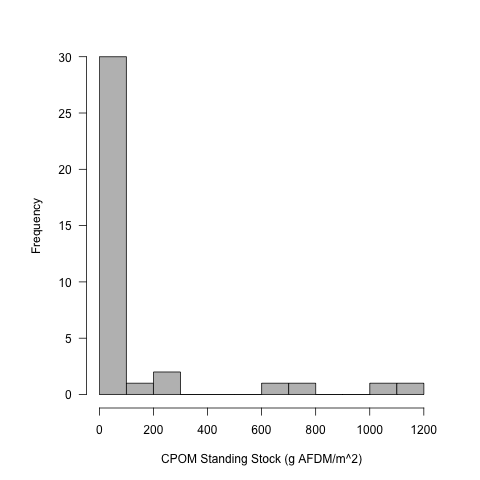

# Analysis of the CPOM Survey Data

## Metadata

* file creation date unknown

### Modified

* 19 Sept 2016 - KF - created publication figure of Standing Stock by pond
* 27 Sept 2016 - KF - created publication figure of LOI by pond and LOI by CPOM Standing Stock
* 3 Mar 2020 - KF - fixed old markdown formatting
* 3 Mar 2020 - KF - replaced references to "Density" with "Standing Stock"
* 3 Mar 2020 - KF - made new plots in response to reviewer comments to better show the mean and spread of the data
* 3 Mar 2020 - KF - made a new data.frame to remove the WL data from the dataset and re-did the summary stats - also took out the significance testing

## Import Data

### Working Directory

### Import

    survey.all <- read.delim("./data/CPOM_survey_2013_calc.csv", header = T, stringsAsFactors = F, sep = ",")
    
#### Removed the Feb sample dates from Wilck's Lake
    
    survey <- survey.all[survey.all$lake != "WL", ]
    survey <- droplevels(survey) #removes unused factor levels
    
## Data Analysis

### Research Questions

1) What is the Standing Stock of CPOM in the study ponds?

2) How does the Standing Stock of CPOM vary among ponds?

3) How does the Standing Stock of CPOM vary within ponds?
     a. Littoral vs Open Habitats
     b. Within Littoral and Open Habitats

4) Does the Standing Stock of CPOM vary with date (WL only)?

5) Is there a relationship between CPOM and percent OM in the sediments?

### Analysis

#### Dates of samples

    with(survey, tapply(date, lake, unique))

########################################
    
     DP       LPP        WC        
     "5/13/13" "3/20/13" "5/14/13" 

########################################

#### Depth of Samples

    with(survey, tapply(depth, location, summary))

################################
# Depth of the samples in m

$littoral
   Min. 1st Qu.  Median    Mean 3rd Qu.    Max. 
   0.60    1.00    1.20    1.14    1.35    1.50 

$open
   Min. 1st Qu.  Median    Mean 3rd Qu.    Max. 
  1.000   1.400   1.900   1.987   2.650   3.200 
###############################

#### Count number of samples

    tapply(survey$CPOM.AFDM, survey$lake, length)
    
#########################################
    
 DP LPP  WC   
 12   6  12   

########################################

#### Standing Stock of CPOM in all samples

    summary(survey$CPOM.AFDM)
    sd(survey$CPOM.AFDM, na.rm = T)
    
########################################
CPOM Standing Stock g m2
    
Min.    1st Qu.   Median     Mean      3rd Qu.  Max.      SD        NAs 
3.436   10.740    43.008     168.742   82.234   1179.309  315.6817  1  

########################################

    par(las = 1)
    hist(survey$CPOM.AFDM, breaks = 10, xlab = "CPOM Standing Stock (g AFDM/m^2)", main = " ", col = 8)
    dev.copy(png, "./output/plots/CPOM_Dens_Hist.png")
    dev.off()

The data show that for all of the samples the Standing Stock of CPOM is mainly under 100 g AFDM / m^2 however there are local patches of higher CPOM with densities between 400 and 1200 g AFDM / m^2.

#### Standing Stock of CPOM among lakes

    tapply(survey$CPOM.AFDM, survey$lake, summary)
    tapply(survey$CPOM.AFDM, survey$lake, sd, na.rm = T)

########################################
CPOM Standing Stock g m2
    
$DP
Min.   1st Qu.  Median  Mean     3rd Qu.  Max.      SD
5.937  16.422   37.445  175.439  59.304   1067.398  343.50936

$LPP
Min.   1st Qu.  Median  Mean    3rd Qu. Max.     SD 
55.81  112.50   220.63  398.70  534.69  1179.31  435.89879

$WC
Min.   1st Qu.  Median    Mean    3rd Qu.    Max.     SD           NAs 
3.436  8.144    10.740    36.003  40.207     195.837  55.37966     1 
 
########################################

##### Plot of CPOM Standing Stock by lake

    par(las = 1, mar = c(5, 6, 3, 3))
    plot(jitter(rep(1, length(survey$CPOM.AFDM[survey$lake == "DP" & survey$location == "littoral"])), 5), survey$CPOM.AFDM[survey$lake == "DP" & survey$location == "littoral"]/1000, pch = 19, cex = 1.5, cex.lab = 1.2, xlim = c(0.5, 4.5), ylim = c(0, 1.2), axes = F, xlab = " ", ylab = expression(paste("Leaf Litter Standing Stock (kg AFDM m"^{-2}, ")")))
    points(jitter(rep(1, length(survey$CPOM.AFDM[survey$lake == "DP" & survey$location == "open"])), 5), survey$CPOM.AFDM[survey$lake == "DP" & survey$location == "open"]/1000, cex = 1.5)
    points(jitter(rep(2, length(survey$CPOM.AFDM[survey$lake == "LPP" & survey$location == "littoral"])), 5), survey$CPOM.AFDM[survey$lake == "LPP" & survey$location == "littoral"]/1000, pch = 19, cex = 1.5)
    points(jitter(rep(2, length(survey$CPOM.AFDM[survey$lake == "LPP" & survey$location == "open"])), 5), survey$CPOM.AFDM[survey$lake == "LPP" & survey$location == "open"]/1000, cex = 1.5)
    points(jitter(rep(3, length(survey$CPOM.AFDM[survey$lake == "WC" & survey$location == "littoral"])), 2), survey$CPOM.AFDM[survey$lake == "WC" & survey$location == "littoral"]/1000, pch = 19, cex =1.5)
    points(jitter(rep(3, length(survey$CPOM.AFDM[survey$lake == "WC" & survey$location == "open"])), 2), survey$CPOM.AFDM[survey$lake == "WC" & survey$location == "open"]/1000, cex = 1.5)
    axis(1, at = c(1, 2, 3), labels = c("Daulton", "Lancer Pk.", "Woodland"), tick = T, cex.axis = 0.8)
    axis(2, cex.axis = 1.2)
    box(lwd = 1)
    legend(3, 1.2, c("Littoral  ", "Open  "), pch = c(19, 1))
    dev.copy(jpeg, "./output/plots/CPOM_Dens_by_lake_scatter.jpg")
    dev.off()

##### Plot of littoral CPOM Standing Stock by lake

    jpeg("./output/plots/littoral_CPOM_scatter.jpg", width = 6, height = 6, units = 'in', res = 1500)
    par(las = 1, mar = c(5, 6, 3, 3))
    plot(CPOM.AFDM/1000 ~ jitter(as.numeric(as.factor(lake)), 0.5), data = survey, subset = location == "littoral", pch = 1, cex = 1.5, cex.lab = 1.2, xlim = c(0.5, 3.5), ylim = c(0, 1.2), axes = F, xlab = " ", ylab = expression(paste("Near Litoral Leaf Litter Standing Stock (kg AFDM m"^{-2}, ")")))
    axis(1, at = c(1, 2, 3), labels = c("Daulton", "Lancer Pk.", "Woodland"), tick = T, cex.axis = 1.5)
    axis(2, cex.axis = 1.2)
    box(lwd = 1)
    text(1.2, mean(survey$CPOM.AFDM[survey$lake == "DP" & survey$location == "littoral"])/1000, "*", cex = 3)
    text(2.2, mean(survey$CPOM.AFDM[survey$lake == "LPP" & survey$location == "littoral"])/1000, "*", cex = 3)
    text(3.2, mean(survey$CPOM.AFDM[survey$lake == "WC" & survey$location == "littoral"], na.rm = T)/1000, "*", cex = 3)
    #dev.copy(jpeg, "./output/plots/CPOM_Dens_by_lake_scatter.jpg")
    dev.off()
    
##### Plot of open CPOM Standing Stock by lake

    jpeg("./output/plots/open_CPOM_scatter.jpg", width = 6, height = 6, units = 'in', res = 1500)
    par(las = 1, mar = c(5, 6, 3, 3))
    plot(CPOM.AFDM/1000 ~ jitter(as.numeric(as.factor(lake)), 0.5), data = survey, subset = location == "open", pch = 1, cex = 1.5, cex.lab = 1.2, xlim = c(0.5, 3.5), ylim = c(0, 0.25), axes = F, xlab = " ", ylab = expression(paste("Near Litoral Leaf Litter Standing Stock (kg AFDM m"^{-2}, ")")))
    axis(1, at = c(1, 2, 3), labels = c("Daulton", "Lancer Pk.", "Woodland"), tick = T, cex.axis = 1.5)
    axis(2, cex.axis = 1.2)
    box(lwd = 1)
    text(1.2, mean(survey$CPOM.AFDM[survey$lake == "DP" & survey$location == "open"])/1000, "*", cex = 3)
    text(2.2, mean(survey$CPOM.AFDM[survey$lake == "LPP" & survey$location == "open"])/1000, "*", cex = 3)
    text(3.2, mean(survey$CPOM.AFDM[survey$lake == "WC" & survey$location == "open"], na.rm = T)/1000, "*", cex = 3)
    #dev.copy(jpeg, "./output/plots/CPOM_Dens_by_lake_scatter.jpg")
    dev.off()
    
    
#### Boxplot of the standing stock by pond
    
    par(las = 1)
    plot(CPOM.AFDM ~ as.factor(lake), data = survey, xlab = "Pond", ylab = "CPOM Standing Stock (g AFDM / m^2)", col = 8)
    dev.copy(png, "./output/plots/CPOM_by_pond.png")
    dev.off()

#### Standing Stock of CPOM within a lake

#### Comparison of the open and littoral habitats.

    tapply(survey$CPOM.AFDM, survey$location, summary)
    tapply(survey$CPOM.AFDM, survey$location, sd, na.rm = T)
    

########################################
$littoral
Min.    1st Qu.   Median     Mean     3rd Qu.     Max.      SD             NAs 
9.712   47.470    66.947     313.658  534.689     1179.309  409.56255      1 

$open
Min.    1st Qu.  Median    Mean    3rd Qu.    Max.     SD 
3.436   7.255    15.920    33.487  26.653     214.938  54.30139 

########################################

## Relationship between CPOM and sediment %OM

##### Variation in %OM 

    summary(survey$sed.propOM)
    sd(survey$sed.propOM, na.rm = T)

########################################
# Sediment % OM 
    
Min.      1st Qu.   Median    Mean      3rd Qu.    Max.     SD            NAs 
0.02363   0.10983   0.12285   0.13270   0.14252    0.22303  0.0458906     6 
 

########################################

   par(las = 1)
   boxplot(survey$sed.propOM * 100, col = 8, ylab = "Percent Organic Matter (LOI 550)")
   dev.copy(png, "./output/plots/percOM_boxplot.png")
   dev.off()

Percent sediment organic matter (LOI 550) in 2013 survey ponds

   par(las = 1)
   hist(survey$sed.propOM * 100, col = 8, breaks = 10)
   dev.copy(png, "./output/plots/percOM_hist.png")
   dev.off()

Frequency histogram percent sediment organic matter (LOI 550) in 2013 survey ponds

##### Variation in percent OM by lake

    tapply(survey$sed.propOM * 100, survey$lake, summary)
    tapply(survey$sed.propOM * 100, survey$lake, sd, na.rm = T)

########################################
$DP
Min.   1st Qu.  Median    Mean    3rd Qu.    Max.    SD        NAs 
2.363  10.797   20.710    15.830  21.227     22.303  8.597525  6 

$LPP
Min.   1st Qu.  Median    Mean    3rd Qu.    Max.    SD 
11.12  11.58    12.38     12.72   13.50      15.27   1.567903

$WC
Min.    1st Qu.  Median    Mean    3rd Qu.    Max.    SD 
10.08   10.74    11.60     12.26   13.05      17.73   2.115659 

########################################

    par(las = 1)
    plot((sed.propOM * 100) ~ as.factor(lake), data = survey, col = 8, xlab = "Pond", ylab = "Percent Sediment Organic Matter (LOI 550)")
    dev.copy(png, "./output/plots/percOM_by_lake.png")
    dev.off()

    par(las = 1)
    plot((sed.propOM * 100) ~ jitter(as.numeric(as.factor(lake)), 1), data = survey, ylim = c(0, 25), col = 1, xlab = "Pond", ylab = "Percent Sediment Organic Matter (LOI 550)", axes = F)
    axis(2)
    axis(1, c("DP", "LPP", "WC", "WL"), at = c(1, 2, 3, 4))
    box()
    #dev.copy(png, "./output/plots/percOM_by_lake_pts.png")
    #dev.off()

Percent sediement organic matter (LOI 550) in the different ponds in 2013 survey

    par(las = 1, mfcol = c(4, 1), mar = c(5, 10, 5, 10))
    hist(survey$sed.propOM[survey$lake == "DP"] * 100, breaks = 10, col = 8, xlim = c(0, 25), xlab = " ", main = "DP")
    hist(survey$sed.propOM[survey$lake == "LPP"] * 100, breaks = 10, col = 8, xlim = c(0, 25), xlab = " ", main = "LPP")
    hist(survey$sed.propOM[survey$lake == "WC"] * 100, breaks = 10, col = 8, xlim = c(0, 25), xlab = " ", main = "WC")
    dev.copy(png, "./output/plots/percOM_by_lake_hist.png")
    dev.off()

Frequency histogram of percent sediement organic matter (LOI 550) in the different ponds in 2013 survey

There are differences in the way that sediment OM is distributed among the lakes.  The two catch-basin lakes (LPP and WC) have the most homogeneous sediment organic matter with virtually all samples falling between 10 and 15% sediment OM.  WL has the lowest sediment OM with virtually all samples falling below 10%.  DP shows a bimodal distribution with a 2 samples under 10% and 4 samples over 20%, so overall DP has the greatest sediment OM.

##### Variation in Perc. OM by location

    tapply(survey$sed.propOM * 100, survey$location, summary)
    tapply(survey$sed.propOM * 100, survey$location, sd, na.rm = T)

########################################

$littoral
Min.    1st Qu.  Median    Mean    3rd Qu.    Max.   SD         NAs 
10.67   11.99    12.86     13.28   13.75      17.73  2.184280   6 

$open
Min.   1st Qu.  Median    Mean    3rd Qu.    Max.    SD
2.363  10.729   11.589    13.264  17.208     22.303  5.645463

########################################

    par(las = 1)
    plot(sed.propOM * 100 ~ as.factor(location), data = survey, col = 8)
    dev.copy(png, "./output/plots/percOM_by_location.png")
    dev.off()

Percent sediement organic matter (LOI 550) in open and littoral regions in 2013 survey

    par(las = 1, mfcol = c(2, 1), mar = c(5, 10, 5, 10))
    hist(survey$sed.propOM[survey$location == "littoral"] * 100, breaks = 10, xlim = c(0, 25), col = 8, main = "Littoral", xlab = " ")
    hist(survey$sed.propOM[survey$location == "open"] * 100, breaks = 10,  xlim = c(0, 25), col = 8, main = "Open", xlab = "Sediment Percent Organic Matter (LOI 550)")
    dev.copy(png, "./output/plots/percOM_by_location_hist.png")
    dev.off()

Frequency histogram of percent sediement organic matter (LOI 550) in open and littoral regions in 2013 survey

Overall there is not a big difference between the littoral and open locations the cluster of high sediment OM in DP is from the open habitat. There were samples with low percent OM from both the littoral and open habitats.

##### Relationship between CPOM and sediment percent OM

    par(las = 1)
    plot((sed.propOM * 100) ~ CPOM.AFDM, data = survey, subset = location == "littoral",  xlim = c(0, 1200), ylim = c(0, 25), pch = 16, ylab = "Percent Sediment Organic Matter (LOI 550)", xlab = "CPOM Standing Stock (g AFDM/m^2)")
    points((sed.propOM * 100) ~ CPOM.AFDM, data = survey, subset = location == "open")
    legend(0.6, 25, c("littoral", "open"), pch = c(16, 1))
    dev.copy(png, "./output/plots/percOM_by_CPOM.png")
    dev.off()

_Percent sediement organic matter (LOI 550) plotted against CPOM (g AFDM/m^2) in open and littoral regions in 2013 survey_

    par(las = 1, mar = c(5, 6, 3, 3))
    plot((sed.propOM * 100) ~ log(CPOM.AFDM), data = survey, subset = location == "littoral", xlim = c(0, 7),   ylim = c(0, 25), pch = 19, ylab = "Percent Sediment Organic Matter (LOI 550)", xlab = expression(paste("ln Leaf Litter Standing Stock (g AFDM m"^{-2}, ")")), cex = 1.5, cex.axis = 1.2, cex.lab = 1.2)
    points((sed.propOM * 100) ~ log(CPOM.AFDM), data = survey, subset = location == "open", cex = 1.5)
    legend(5, 25, c("littoral", "open"), pch = c(19, 1))
    dev.copy(jpeg, "./output/plots/percOM_by_lnCPOM.jpg")
    dev.off()

_Percent sediement organic matter (LOI 550) plotted against ln transformed CPOM (ln g AFDM/m^2) in open and littoral regions in 2013 survey_

There is no relationship between CPOM Standing Stock and sediment organic matter content.

    summary(lm(sed.propOM ~ CPOM.AFDM, data = survey)) 

########################################
Regression of Sediment percent OM and Leaf Litter Standing Stock

Call:
lm(formula = sed.propOM ~ CPOM.AFDM, data = survey)

Residuals:
      Min        1Q    Median        3Q       Max 
-0.098768 -0.018620 -0.001738  0.019615  0.109888 

Coefficients:
              Estimate Std. Error t value Pr(>|t|)    
(Intercept)  1.134e-01  1.148e-02   9.881 6.05e-11 ***
CPOM.AFDM   -1.514e-05  4.089e-05  -0.370    0.714    

Residual standard error: 0.05686 on 30 degrees of freedom
  (22 observations deleted due to missingness)
Multiple R-squared:  0.004549, Adjusted R-squared:  -0.02863 
F-statistic: 0.1371 on 1 and 30 DF,  p-value: 0.7138

########################################

## Sediment Plots for Manuscript

#

    jpeg("./output/plots/sedOM_by_lake.jpg", width = 6, height = 6, units = 'in', res = 1500)
    par(las = 1) # mar = c(2, 8, 2, 8), mfcol = c(2, 1))
    #plot of LOI by lake
    plot(sed.propOM * 100 ~ jitter(as.numeric(as.factor(lake)), 0.5), data = survey, subset = location == "littoral", pch = 19, axes = F, ylab = "Sediment Organic Matter (%)", xlab = " ", ylim = c(0, 25), xlim = c(0.5, 3.5), cex = 1.3, cex.lab = 1.2)
    points(sed.propOM * 100 ~ jitter(as.numeric(as.factor(lake)), 0.5), data = survey, subset = location == "open", pch = 1, cex = 1.3)
    axis(2)
    axis(1, c("Daulton", "Lancer Pk.", "Woodland", "Wilck's"), at = c(1, 2, 3, 4), cex.axis = 1.5)
    box()
    legend(2.5, 25, c("Near Littoral", "Open"), pch = c(19, 1), cex = 1.2)
    dev.off()
    
    
    #plot of LOI by CPOM Standing Stock
    # make x variable
    CPOM.Dens.kg <- survey$CPOM.AFDM/1000
    jpeg("./output/plots/sedOM_by_CPOM.jpg", width = 6, height = 6, units = 'in', res = 1500)
    par(las = 1) #, mar = c(4, 8, 0.6, 8))
    plot(sed.propOM * 100 ~ CPOM.Dens.kg, data = survey, subset = location == "littoral", pch = 19, ylab = "Sediment Organic Matter (%)", xlab = expression(paste("Leaf Litter Standing Stock (kg AFDM m"^{-2}, ")")), ylim = c(0, 25), xlim = c(0, 1.2), cex = 1.3, cex.axis = 1.2, cex.lab = 1.2)
    points(sed.propOM * 100 ~ CPOM.Dens.kg, data = survey, subset = location == "open", pch = 1, cex = 1.3)
    legend(0.8, 25, c("Near Littoral", "Open"), pch = c(19, 1), cex = 1.2)
    #text(0.1, 24, "B", cex = 1)
    #dev.copy(jpeg, "./output/plots/LOI_survey.jpg")
    dev.off()

# Reanalysis of the data in response to comments on from reviewers 
    
NOTE:  I am no longer doing this but rather reporting the data without statistical comparison.

Following the review of the manuscript for Aquatic Ecology, I am redoing the analysis to eliminate the pseudoreplication in the comparison of the ponds.

## Average the CPOM AFDM by lake per sampling date

## Create variables of the mean littoral and open CPOM AFDM in each lake
    littoral.AFDM <- as.numeric(tapply(survey$CPOM.AFDM[survey$lake != "WL" & survey$location == "littoral"], survey$lake[survey$lake != "WL" & survey$location == "littoral"], mean, na.rm = T))
    
    open.AFDM <- as.numeric(tapply(survey$CPOM.AFDM[survey$lake != "WL" & survey$location == "open"], survey$lake[survey$lake != "WL" & survey$location == "open"], mean, na.rm = T))
    
## Create variables of the mean littoral and open perc sediment OM in each lake
    littoral.sed.propOM <- as.numeric(tapply(survey$sed.propOM[survey$lake != "WL" & survey$location == "littoral"], survey$lake[survey$lake != "WL" & survey$location == "littoral"], mean, na.rm = T))
    
    open.sed.propOM <- as.numeric(tapply(survey$sed.propOM[survey$lake != "WL" & survey$location == "open"], survey$lake[survey$lake != "WL" & survey$location == "open"], mean, na.rm = T))

## Create a data.frame for the analysis

    lake <- rep(c("DP", "LPP", "WC"), 2)
    location <- c(rep("littoral", 3), rep("open", 3))
    julian <- rep(c(133, 79, 134), 2)
    AFDM <- c(littoral.AFDM, open.AFDM)
    sed.propOM <- c(littoral.sed.propOM, open.sed.propOM)

    survey.mean <- data.frame(lake, location, julian, AFDM, sed.propOM)
    
## Analyze the difference between the open and littoral habitats

In these models I used location as the main factor and lake as a blocking factor and julian date as a covariate.

    anova(lm(AFDM ~ location + julian + lake, data = survey.mean))
    
########################################

Analysis of Variance Table

Response: AFDM
          Df Sum Sq Mean Sq F value Pr(>F)
location   1 147766  147766  4.5695 0.1660
julian     1 114897  114897  3.5530 0.2001
lake       1  17296   17296  0.5348 0.5407
Residuals  2  64675   32338            

########################################

    anova(lm(sed.propOM ~ location + julian + lake, data = survey.mean))

########################################

Analysis of Variance Table

Response: sed.propOM
          Df     Sum Sq    Mean Sq  F value  Pr(>F)  
location   1 0.00001576 0.00001576   9.9003 0.19590  
julian     1 0.00006950 0.00006950  43.6523 0.09563 .
lake       1 0.00113923 0.00113923 715.5099 0.02379 *
Residuals  1 0.00000159 0.00000159    

########################################
